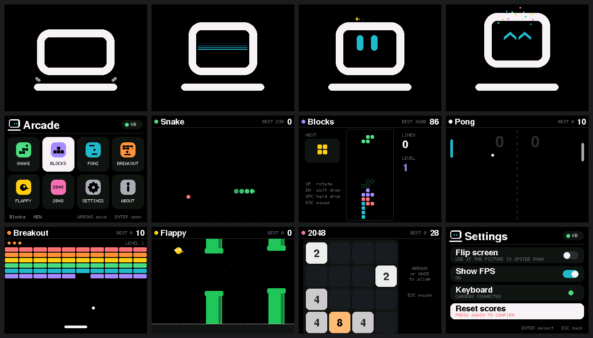

# Altoids Gameboy – Arcade OS v1.1 (landscape)

Boot animation → playful transition → game menu, plus 6 built-in games:
**Snake, Blocks (falling blocks), Pong, Breakout, Flappy, 2048**, and Settings / About.

**Screen orientation:** landscape 320x240 with the display's pins on the LEFT.
If the picture is upside down, open **Settings > Flip screen** (saved permanently), or change
`SCREEN_ROTATION` in `AltoidsOS.ino` from `1` to `3`.

## Upload
1. Open `AltoidsOS/AltoidsOS.ino` in Arduino IDE (all `.h` files open as tabs automatically).
2. Libraries: **Adafruit ST7735 and ST7789 Library** (installs Adafruit GFX + BusIO), **NimBLE-Arduino** 2.x.
3. Tools: Board **ESP32S3 Dev Module**, Flash Size **16MB**, PSRAM **OPI PSRAM**,
   Partition **16M Flash (3MB APP/9.9MB FATFS)**, USB CDC On Boot **Disabled** (UART port).
4. Upload, then put the CardKB2 in BLE mode (**Fn + Sym + 4**). The **KB** dot in the menu turns green when connected.

## Controls
| Key | Action |
|---|---|
| Arrows or W A S D | Move / navigate (menu is a 4x2 grid) |
| SPACE or ENTER | Select / action (flap, launch, hard drop) |
| ESC or BACKSPACE | Back / pause |
| P | Pause |

Blocks: UP rotate, DOWN soft drop, SPACE hard drop. Pong: UP/DOWN moves your (left) paddle.

## Notes
- Drawing goes to a 240x320 frame buffer in PSRAM and is sent to the screen in one go, so there is no flicker.
  **PSRAM must be set to OPI** or the screen shows "No memory".
- Bluetooth runs on core 0, graphics on core 1, so connecting never freezes the animation.
- Best scores and settings are saved in flash (Preferences) and survive power-off.
- Games were written for this exact screen + keyboard (ready-made Arduboy / emulator games need different hardware).
