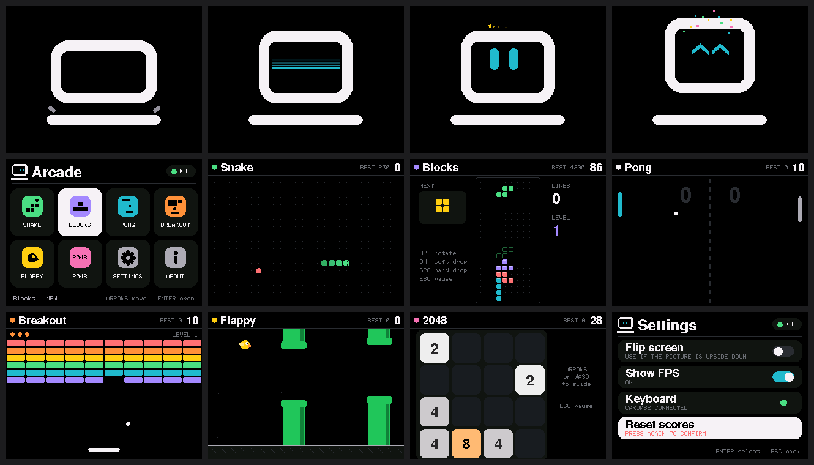
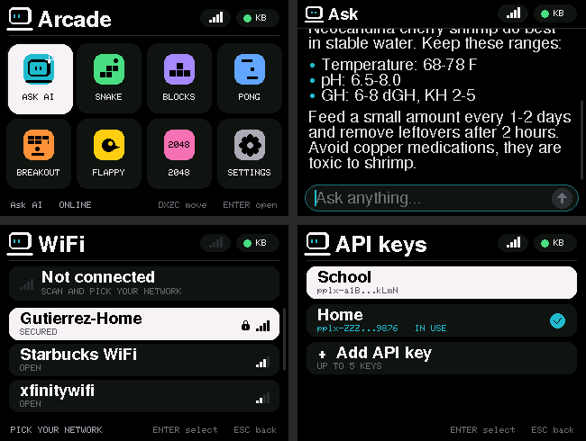

# Altoids Gameboy

A pocket game console in an Altoids tin: **ESP32-S3 + 2.4" ST7789 screen + M5Stack CardKB2 keyboard (Bluetooth)**,
running on a 700mAh LiPo.

## Repo layout
| Folder | What's in it |
|---|---|
| `firmware/AltoidsOS_OneFile/` | **The main program** (Arcade OS v1.5). One file: boot animation, menu, Ask AI chat, WiFi, 6 games, settings. |
| `docs/Wiring-and-Power.md` | Full wiring + power plan (battery, TP4056, switch, MT3608, display). |
| `docs/images/` | Wiring diagram, screenshots, startup animation. |
| `tests/ScreenTest/` | Simple screen test (use first if the screen shows nothing). |
| `tests/KeyboardScreenTest/` | Screen + CardKB2 Bluetooth test (shows raw key codes). |
| `archive/` | First BLE experiment, kept for reference only. |

## Upload the firmware
1. Arduino IDE → open `firmware/AltoidsOS_OneFile/AltoidsOS_OneFile.ino`
   (or paste its contents into any sketch — it is a single file).
2. Libraries: **Adafruit ST7735 and ST7789 Library** (+ Adafruit GFX), **NimBLE-Arduino** 2.x.
3. Tools: **ESP32S3 Dev Module**, Flash **16MB**, PSRAM **OPI PSRAM**,
   Partition **16M Flash (3MB APP/9.9MB FATFS)**, USB CDC On Boot **Disabled**.
4. Upload, then put the CardKB2 in BLE mode: **Fn + Sym + 4**. The **KB** dot turns green when connected.

## Controls
| Key | Action |
|---|---|
| **D** up · **X** down · **Z** left · **C** right | Move / navigate (arrow keys also work) |
| SPACE or ENTER | Select / action |
| ESC or BACKSPACE | Back / pause |
| P | Pause |

**Typing (Ask AI, passwords, API keys):** letters/numbers type (use the CardKB2 Shift/Sym for capitals and symbols),
BACKSPACE deletes, ENTER sends/saves, ESC stops an answer or goes back, arrow keys scroll,
TAB switches to scroll mode (then D/X also scroll). Type `/new` in the chat to clear it.

## Ask AI setup (Perplexity API)
1. **Settings → WiFi → Scan for networks**, pick your network, type the password (case sensitive), ENTER.
   Up to 5 networks are saved; the strongest saved one connects automatically at boot. 2.4 GHz WiFi only.
2. Make an API key at [console.perplexity.ai](https://console.perplexity.ai/project/keys) (API Keys page).
   API use is billed by Perplexity to that account.
3. **Settings → API keys → + Add API key**: name it, then type the key (starts with `pplx-`).
   Big letters are used so you can check every character; numbers show in teal, symbols in yellow.
   Up to 5 keys are saved; ENTER on a key to switch to it or delete it.
4. Open **Ask AI** from the menu and type a question. Answers stream in with their web sources.
- **AI mode**: Fast (preset `fast`) or Pro (preset `low`, deeper research, costs more).
- **Short answers**: asks for answers that fit the small screen.
- **Secure connection**: verifies the API server certificate (leave ON; only turn OFF to troubleshoot).
- Uses the Perplexity **Agent API** (`POST https://api.perplexity.ai/v1/agent`, streaming).
- Keys and WiFi passwords are stored in the ESP32's flash (not encrypted) — don't lend the device out with your key on it.
- Bluetooth keyboard input can lag briefly while an answer is being fetched (WiFi and Bluetooth share one radio).

## Hardware summary
| Part | Connection |
|---|---|
| ST7789 display | GND→GND, VCC→3V3, SCK→GPIO12, SDA→GPIO11, RST→GPIO10, DC→GPIO9, CS→GPIO8 |
| Power | LiPo → TP4056 → switch → MT3608 (5.00V) → ESP32 5V/GND, 220–470µF cap on boost output |
| Keyboard | M5Stack Unit CardKB2 over Bluetooth LE (no wires) |

Screen orientation: landscape with the display pins on the **left** (`SCREEN_ROTATION 3`).
If it's ever upside down: **Settings → Flip screen**.
